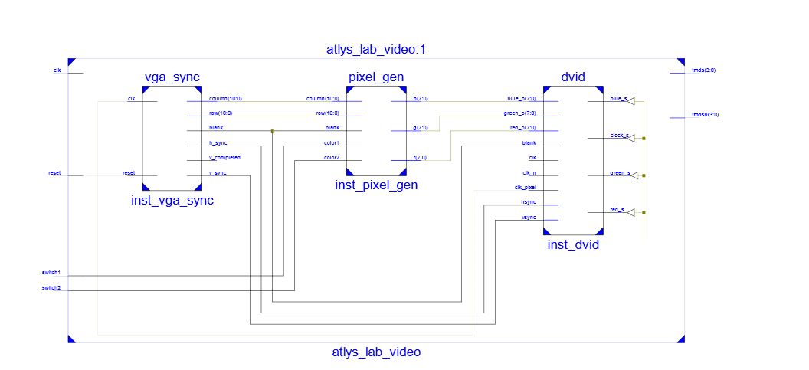
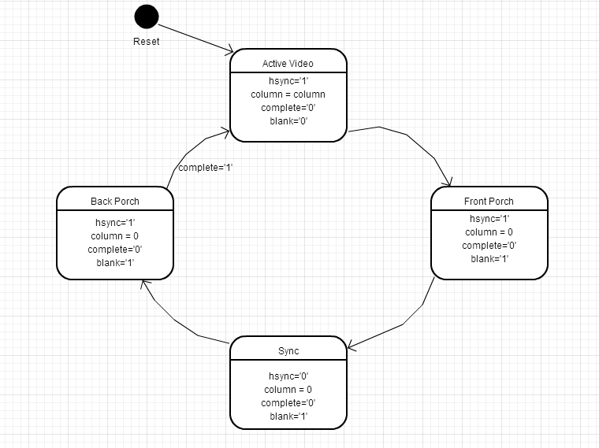

#Lab 1
##Introduction
The purpose of this lab was to implement a VGA controller in VHDL and implement it on our Spartan VI boards.  We were provided VGA-to-HDMI module was used to allow the use of the onboard HDMI port.  The video controller is written in a modified version of the major-minor FSM methodology taught in class.
##Implementation
###Schematic

###State Diagrams
####Hsync

####VSync

##Test/Debug
Much of the debugging was done through visual analysis of the signals to verify that they were correct.  Since my original implemenation was off by one due to the fact that I was not taking into account '0', my test files also made the same mistake when the for loops started at '0' as well.  A comparison of signal output between Bill Parks and my own led me to correct the implementation of the row counter in the V sync module.
##Conclusion
Since most of the time spent outside of coding was frustration with why my implementation didn't work, my biggest conclusion to take out of this lab is the importance of good coding in accordance with VHDL and the Xilinx synthesizer.  There isn't any room to try and be creative with your code.  Code by the book and understand the exact requirements of each module as you create it, so the errors in the small modules don't interfere with work on larger modules down the road.
##Documentation
C2C Parks provided me the opportunity to compare my output signals to his.
